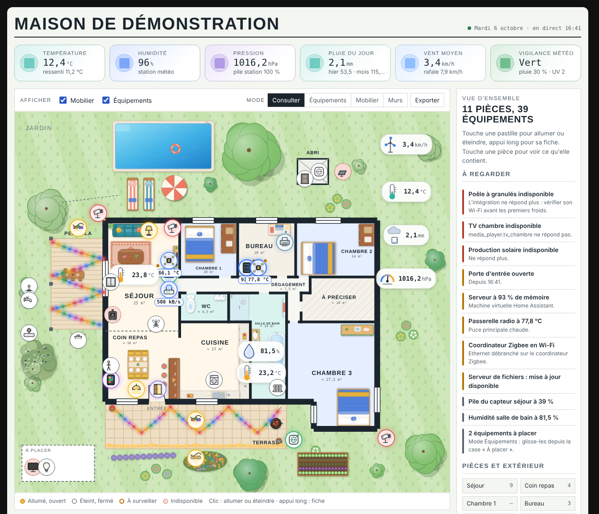
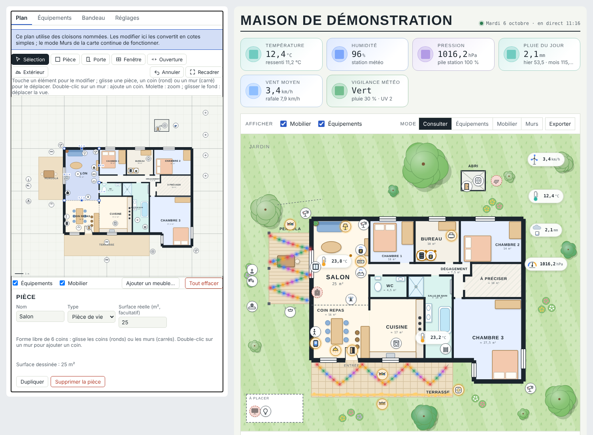

# Plan Maison Card

[](https://hacs.xyz/docs/faq/custom_repositories/) [](https://github.com/albaric/plan-maison-card/actions/workflows/validate.yml)

Carte Lovelace pour Home Assistant qui affiche **le plan de ta maison** : pièces, cloisons, portes et fenêtres, jardin, mobilier, et tes équipements sous forme de pastilles animées que tu peux allumer, éteindre ou consulter d'un geste.

Tout se règle en YAML, puis s'ajuste à la souris directement sur le plan : cloisons déplaçables, équipements et meubles glissés à leur place, icônes choisies dans une bibliothèque. Un bouton **Exporter** produit la configuration complète, prête à recoller ou à partager sur un autre Home Assistant.



## Ce que fait la carte

- **Plan vectoriel** : les pièces sont des polygones en mètres. Les murs sont déduits des pièces : un bord partagé devient une cloison, un bord seul devient la façade (trait épais). Portes, passages et fenêtres découpent ou habillent les murs.
- **Mode Murs** : chaque cloison a une poignée. Les pièces, portes et fenêtres qui en dépendent suivent, et les cloisons voisines sont poussées si besoin. Un tableau compare les surfaces calculées à celles que tu as indiquées.
- **Équipements animés** : 46 icônes animées en couleur, rangées par familles (lumière, ouvrants, sécurité, chauffage, eau, cuisine, multimédia, réseau…) : l'ampoule rayonne, la porte s'ouvre, l'aspirateur roule, le robinet coule, la caméra balaie ; un halo de la couleur de la famille signale les appareils actifs. L'icône est devinée d'après l'entité, et tu peux en changer en touchant la pastille en mode Équipements.
- **Widgets météo** sur le plan : thermomètre, anémomètre (vitesse de rotation liée au vent), pluviomètre (le bocal se remplit), baromètre (aiguille), hygromètre (goutte qui se remplit selon l'humidité, couleur de sec à humide, bulles au-delà de 65 %). Ils sont choisis automatiquement selon la classe du capteur.
- **Mobilier** illustré, un dessin par meuble : 73 meubles rangés par pièce (salon, repas, chambre, bureau, cuisine, salle de bain, jardin), avec leurs détails (vaisselle, livres, serviettes, canard dans le bain, potager, piscine, pergola en glycine…). Plans de travail, piscine, potager, haie… se redimensionnent ; canapés, lits, tapis… changent de couleur.
- **Guirlandes lumineuses** dessinées sur le plan, qui s'allument avec leur entité.
- **Bandeau** de tuiles (météo ou autres capteurs) et panneau **« À regarder »** : équipements indisponibles, portes ouvertes, piles faibles, mises à jour, plus tes propres règles.
- Thème clair et sombre (suit Home Assistant), animations coupées si le système demande moins de mouvement.

La disposition modifiée à la souris est enregistrée **par utilisateur Home Assistant** (stockage `frontend/user_data`). Elle ne touche pas à la configuration YAML tant que tu ne l'exportes pas.

L'interface de la carte est en français.

## Installation

### Avec HACS (recommandé)

1. HACS → menu ⋮ → **Dépôts personnalisés**.
2. Ajoute l'URL `https://github.com/albaric/plan-maison-card`, catégorie **Dashboard** (ou « Lovelace » selon la version de HACS).
3. Cherche **Plan Maison Card**, installe-la, puis recharge le navigateur (Ctrl+Maj+R).

HACS déclare la ressource `/hacsfiles/plan-maison-card/plan-maison-card.js` tout seul.

### À la main

1. Télécharge `plan-maison-card.js` depuis la [dernière version](https://github.com/albaric/plan-maison-card/releases/latest) et copie-le dans `/config/www/`.
2. Paramètres → Tableaux de bord → ⋮ → **Ressources** → Ajouter : URL `/local/plan-maison-card.js`, type **Module JavaScript**.
3. Recharge le navigateur.

## Démarrage rapide : dessiner son plan à la souris

1. Tableau de bord → crayon (Modifier) → **Ajouter une carte** → **Plan maison**.
2. L'**éditeur visuel** s'ouvre à gauche, l'aperçu à droite. Il part d'un petit plan d'exemple : garde-le, modifie-le ou clique sur **Tout effacer**.
3. Onglet **Plan** :
   - outil **Pièce** : fais glisser pour dessiner une pièce rectangulaire. Les bords s'aimantent aux murs existants, les dimensions s'affichent en mètres. Donne-lui un nom et un type dans le panneau du dessous (ou tape ses cotes exactes) ;
   - outil **Forme libre** : clique pour poser chaque coin d'une pièce qui n'est pas rectangulaire (L, pan coupé, bow-window…), puis clique sur le premier coin, double-clique ou appuie sur Entrée pour la fermer. Les traits s'alignent d'eux-mêmes à l'horizontale et à la verticale ;
   - outils **Porte**, **Fenêtre**, **Ouverture** : touche un mur pour l'y poser, puis règle largeur, arc d'ouverture et libellé ;
   - outil **Extérieur** : terrasse, pergola, abri, piscine, potager, allée ;
   - outil **Guirlande** : clique les points d'accroche (zigzag sous une pergola, ligne le long d'une terrasse…), double-clique pour terminer, puis choisis l'interrupteur qui l'allume et le type d'ampoules (multicolores ou blanc chaud). Sur la carte, elle s'illumine quand l'appareil est allumé et un clic l'allume ou l'éteint ;
   - outil **Sélection** : glisse une pièce, un coin (rond) ou un mur. Déplacer un mur commun déplace les deux pièces et ses portes. Pour changer la forme d'une pièce, touche le **« + »** au milieu d'un de ses murs et tire le nouveau coin ; touche un coin pour saisir sa position au centimètre ou le supprimer. Molette pour zoomer, glisser le fond pour déplacer la vue, Ctrl+Z pour annuler ;
   - **Ajouter un meuble…** ouvre la bibliothèque ; un meuble se glisse, R le pivote, Suppr l'enlève.
4. Onglet **Équipements** : tape le nom d'un appareil (« lampe salon », « porte entrée »…) et choisis-le dans la liste, sans avoir à connaître son identifiant technique. Il apparaît au centre du plan : glisse la pastille à sa place et touche-la pour choisir son icône animée.
5. Onglets **Bandeau** (tuiles météo ou capteurs) et **Réglages** (titre, thème, jardin, alertes).
6. **Enregistrer**.

Les murs se tracent tout seuls : épais en façade, fins entre deux pièces.



Tout reste aussi faisable en YAML (bouton « Afficher l'éditeur de code » de Home Assistant) : pars de [`examples/simple.yaml`](examples/simple.yaml), ou de l'exemple complet [`examples/complete.yaml`](examples/complete.yaml) (11 pièces, cloisons nommées, 38 équipements, bandeau météo, règles d'alerte). Un plan à cloisons nommées reste modifiable dans l'éditeur visuel : au premier déplacement de mur, il est converti en cotes simples.

La carte occupe toute la largeur. Dans une vue « Panneau » ou « Sections », elle s'adapte ; sous 860 px de large, le panneau latéral passe sous le plan.

```yaml
type: custom:plan-maison-card
title: Ma maison
rooms:
  - {name: Séjour, kind: jour, rect: [0, 0, 6, 4.5]}
  - {name: Cuisine, kind: jour, rect: [6, 0, 10, 4.5]}
  - {name: Chambre, kind: nuit, rect: [0, 4.5, 10, 8]}
openings:
  - {type: door, from: [2, 0], to: [2.9, 0], swing: down, label: Entrée}
  - {type: open, from: [6, 1], to: [6, 3.5]}
  - {type: door, from: [4, 4.5], to: [4.8, 4.5]}
  - {type: window, from: [7, 0], to: [9, 0]}
devices:
  - {entity: light.salon, x: 3, y: 2}
  - {entity: sensor.salon_temperature, x: 1, y: 3.5}
```

## Coordonnées

- Toutes les cotes sont en **mètres**. L'origine est où tu veux (en pratique le coin nord-ouest de la maison). **x** va vers la droite (est), **y** vers le bas (sud).
- Une coordonnée peut être un nombre (`4.1`) ou une **référence à un axe** (`xS`), éventuellement décalée (`xS+0.5`, `xC1-1.1`).
- Le pas de déplacement à la souris est de 5 cm.

### Axes (cloisons déplaçables)

Deux façons de faire :

- **Automatique** (si tu ne déclares pas `axes`) : chaque valeur de x ou de y utilisée par les sommets des pièces devient une cloison déplaçable. Toutes les pièces qui partagent cette valeur bougent ensemble, ainsi que les portes et fenêtres posées sur ce mur. C'est le plus simple pour démarrer.
- **Nommée** : tu déclares des axes et tu les utilises dans les points. Cela permet d'avoir deux cloisons à la même cote mais indépendantes, d'ancrer une porte sur une cloison (`xC1-1.1`), ou de laisser la façade fixe (les nombres restent fixes).

```yaml
axes:
  xS: {value: 4.1, label: "Séjour | chambre 1"}   # label facultatif, sinon il est calculé
  yD: 4
rooms:
  - {name: Séjour, points: [[0, 0], [xS, 0], [xS, yD], [0, yD]]}
```

`auto_axes: true` force le mode automatique même quand des axes sont déclarés : les nombres deviennent alors eux aussi déplaçables.

## Référence de la configuration

### Général

| Clé | Défaut | Rôle |
|---|---|---|
| `title` | `Maison` | Titre affiché en haut. |
| `header` | `true` | `false` masque le titre et l'heure. |
| `layout_key` | `plan_maison_<titre>` | Clé de stockage de la disposition par utilisateur. Deux cartes avec la même clé partagent leur disposition. |
| `view` | calculé | Cadre visible `[x, y, largeur, hauteur]` en mètres. |
| `theme` | `auto` | `auto`, `light` ou `dark`. |
| `fonts` | `true` | `false` n'importe pas les polices Google (Barlow Condensed, Source Sans 3, JetBrains Mono). |

### `rooms` — pièces

| Clé | Rôle |
|---|---|
| `id` | Identifiant stable (conseillé : il sert pour la disposition enregistrée). |
| `name` | Nom affiché. |
| `kind` | Couleur de la pièce : `jour`, `nuit`, `eau`, `service`, `circ` (circulation), `todo` (hachuré). Synonymes anglais : `living`, `bedroom`, `bathroom`, `utility`, `hall`, `unknown`. |
| `rect` | `[x1, y1, x2, y2]` pour une pièce rectangulaire… |
| `points` | …ou la liste des sommets `[[x, y], …]` pour toute autre forme. |
| `area` | Surface de référence en m², comparée à la surface calculée en mode Murs. |
| `label` | Position du nom `[x, y]` ; sinon placée automatiquement en évitant meubles et pastilles. |
| `label_size` | Hauteur maximale du nom en mètres. |

### `openings` — portes, passages, fenêtres

`{type, from: [x, y], to: [x, y]}`, posés sur un mur (horizontal ou vertical).

| `type` | Rendu |
|---|---|
| `door` | Ouverture dans le mur. Avec `swing: up/down/left/right`, l'arc d'ouverture est dessiné (le battant part de `from`). `label` ajoute un texte côté extérieur. |
| `passage` | Ouverture sans arc. |
| `open` | Pas de mur entre deux pièces ; ligne pointillée sauf avec `dashed: false`. |
| `window` | Fenêtre dessinée sur le mur. |

### `zones` — extérieurs

`{id, name, type, rect: [x1, y1, x2, y2]}`. Types : `deck` (terrasse, `pattern: tiles` ou `slats`, `posts: true` pour des poteaux de pergola), `shed` (abri), `patch`, `pool`, `gravel`. `show_size: true` affiche les dimensions.

### `garden` — jardin

`garden: false` supprime le jardin. Sinon :

```yaml
garden:
  label: Jardin
  trees: [[8, -3.8, 1.6, t1], [-3.2, -0.6, 1.1, t2]]   # x, y, rayon, teinte t1/t2/t3
  flowers: [[-4.4, 3.4, "#c9a3e6"]]                  # x, y, couleur
  paths: [[[-2.4, -1], [0.8, -1.4]]]                 # tracés pointillés
```

Sans `trees`, quelques arbres sont placés automatiquement autour de la maison.

### `garlands` — guirlandes lumineuses

```yaml
garlands:
  - entity: light.terrasse
    name: Guinguette
    points: [[0.4, 10.3], [2, 11.7], [3.6, 10.3]]
    sag: 0.15          # flèche du câble entre deux points (m)
    style: warm        # ampoules blanc chaud ; sinon multicolore
    colors: ["#e5484d", "#3e7bfa"]   # ou une liste de couleurs
    spacing: 0.33      # écart entre ampoules (m)
    size: 0.11         # taille des ampoules (m)
```

Un clic sur la guirlande allume ou éteint l'entité.

### `devices` — équipements

| Clé | Rôle |
|---|---|
| `entity` | Entité Home Assistant (obligatoire). |
| `id` | Identifiant stable (par défaut : l'entité). |
| `name` | Nom affiché (par défaut : `friendly_name`). |
| `x`, `y` | Position. Sans position, l'équipement attend dans la case « À placer ». |
| `icon` | Icône animée de la bibliothèque (voir plus bas) ou icône `mdi:…` statique. Par défaut, elle est devinée. |
| `kind` | `toggle` (clic = allumer/éteindre), `info` (clic = fiche), `value` (valeur affichée), `widget`. Par défaut : `toggle` pour light/switch/input_boolean/fan, `value` pour un capteur avec unité, sinon `info`. Si tu choisis une icône pour un capteur avec unité, l'icône s'affiche avec sa valeur en pastille (sauf `kind: value` explicite, et sauf pour les widgets météo : ajoute `widget: false` pour leur préférer l'icône). |
| `widget` | `false` affiche la valeur brute au lieu du widget animé. |
| `warn` | `{entity, above, below, prefix}` : pastille « à surveiller » quand la valeur dépasse un seuil. |
| `gust` | Anémomètre : capteur de rafales (traînées de vent au-delà de 15 km/h). |
| `intensity` | Pluviomètre : capteur d'intensité (gouttes animées quand il pleut). |

Les capteurs de température, humidité, vent, précipitations et pression deviennent automatiquement des widgets animés. Un thermomètre placé hors des pièces affiche un soleil au-delà de 22 °C.

Appui long (ou clic droit) sur une pastille : fiche Home Assistant de l'entité.

### `furniture` — mobilier

`{type, x, y, rot, w, h, color}` avec un type du catalogue (`w` et `h` en mètres pour le redimensionner, `color` pour les tissus), ou `{name, parts, x, y, style}` pour un meuble sur mesure. Dans l’éditeur, un bouton « Illustrer » remplace les meubles sur mesure par les illustrations du catalogue, à la même place et à la même taille. `parts` est une liste de formes en mètres : `[r, x, y, largeur, hauteur, arrondi]`, `[c, cx, cy, rayon]`, `[e, cx, cy, rx, ry]`, `[l, x1, y1, x2, y2]`.

Styles : `wood`, `sofa`, `bed`, `rug`, `plant`, `ceramic`, `bath`, `shower`, `counter`, `app`, `metal`, `stove`, `stool`, `garden`, `lamp`, `tv`, `parasol`, `piano`, `dining`.

### `banner` — tuiles du bandeau

```yaml
banner:
  - entity: sensor.exterieur_temperature
    name: Dehors
    icon: mdi:thermometer
    color: temperature            # couleur selon la température, ou "#3e7bfa"
    decimals: 1
    secondary: "ressenti {sensor.ressenti:1} °C"
  - entity: sensor.vigilance
    colors: {Vert: "#2f9e5a", Orange: "#f07a2c"}
    icons: {Vert: mdi:shield-check-outline}
```

Dans `secondary`, `{sensor.x}` insère la valeur d'une entité et `{sensor.x:1}` l'arrondit à une décimale.

### `alerts` — panneau « À regarder »

```yaml
alerts:
  auto: true        # équipements placés indisponibles, portes/fenêtres ouvertes, seuils « warn »
  battery: 20       # piles sous 20 % (toute l'installation), false pour désactiver
  updates: true     # entités update.* disponibles
  rules:
    - {entity: climate.poele, state: unavailable, level: na, title: "Poêle indisponible", text: "Vérifier son Wi-Fi."}
    - {entity: binary_sensor.porte, state: "on", title: "Porte ouverte", text: "Depuis {since}."}
    - {entity: sensor.ram, above: 90, title: "RAM à {value:0} %"}
    - {entity: sensor.vigilance, not: [Vert, unavailable, unknown], title: "Vigilance {state}"}
```

Conditions : `state` (valeur ou liste), `not`, `above`, `below`. Niveaux : `na` (rouge), `warn` (orange), `info` (gris). Variables : `{state}`, `{value}`, `{value:N}`, `{name}`, `{since}`, `{sensor.autre}`. Une entité qui a sa propre règle n'est plus signalée automatiquement.

## Utilisation

| Mode | Gestes |
|---|---|
| **Consulter** | Clic sur une pastille = allumer/éteindre ou fiche ; appui long = fiche ; clic sur une pièce = son détail dans le panneau. |
| **Équipements** | Glisser une pastille ; la toucher pour choisir son icône ou la retirer ; ajouter une entité par son identifiant ; remettre un équipement retiré. |
| **Mobilier** | Glisser un meuble ; le toucher pour le pivoter ou le retirer ; clavier : flèches (Maj = 50 cm), R, Suppr ; « Ajouter un meuble… » ouvre la bibliothèque ; la fiche d’un meuble propose ses couleurs. |
| **Murs** | Glisser les poignées bleues ; tableau des surfaces. |

Ces réglages faits directement sur la carte sont enregistrés **pour ton compte**. Pour les rendre définitifs pour tout le monde, ouvre l'éditeur visuel de la carte : un bandeau propose de **les intégrer** à la configuration.

**Exporter** ouvre la configuration YAML complète avec la disposition actuelle, pour la partager ou la reproduire sur un autre Home Assistant.

### Icônes animées

`bulb` Ampoule · `bulbrgb` Ampoule couleur · `lamp` Lampe · `ceiling` Plafonnier, applique · `string` Guirlande · `guinguette` Guinguette · `spot` Projecteur · `flood` Éclairage extérieur · `socket` Prise · `strip` Multiprise · `solar` Panneau solaire · `ev` Borne de recharge · `door` Porte · `window` Fenêtre, baie · `shutter` Volet · `garage` Porte de garage · `motion` Présence · `camera` Caméra · `shield` Alarme · `lock` Serrure · `doorbell` Sonnette · `fire` Poêle, cheminée · `radiator` Radiateur · `thermostat` Thermostat · `heatpump` Climatisation, PAC · `fan` Ventilateur · `purifier` Purificateur d'air · `mosquito` Anti-moustiques · `faucet` Robinet · `sprinkler` Arroseur · `valve` Vanne · `pool` Piscine · `dishwasher` Lave-vaisselle · `washer` Lave-linge · `fridge` Réfrigérateur · `oven` Four · `coffee` Machine à café · `vacuum` Aspirateur robot · `printer` Imprimante · `tv` Télévision · `speaker` Enceinte · `tablet` Tablette, écran · `server` Serveur · `router` Box internet · `zigbee` Zigbee, radio · `generic` Générique

L'animation se joue quand l'équipement est allumé, ouvert ou actif. Caméras, serveurs, box et radios Zigbee restent animés tant qu'ils répondent.

### Catalogue de mobilier

**Salon** : `canape` Canapé ↔ 🎨 · `canapeangle` Canapé d'angle 🎨 · `fauteuil` Fauteuil 🎨 · `pouf` Pouf 🎨 · `tablebasse` Table basse ↔ · `tablebasseronde` Table basse ronde · `meubletv` Meuble TV ↔ · `tvx` Télévision ↔ · `biblio` Bibliothèque ↔ · `cheminee` Cheminée · `piano` Piano · `lampadaire` Lampadaire · `tapis` Tapis ↔ 🎨 · `tapisrond` Tapis rond 🎨 · `poele` Poêle · `plante` Plante · `grandeplante` Grande plante

**Repas** : `table` Table ↔ · `tablerepas` Table et 6 chaises 🎨 · `tableronde` Table ronde · `tablerondechaises` Table ronde et 4 chaises 🎨 · `chaise` Chaise 🎨

**Chambre** : `lit2` Lit double ↔ 🎨 · `lit1` Lit simple 🎨 · `litbebe` Lit bébé 🎨 · `chevet` Table de chevet · `armoire` Armoire ↔ · `commode` Commode 🎨

**Bureau** : `bureau` Bureau ↔ · `chaisebureau` Fauteuil de bureau 🎨

**Cuisine** : `cuisine` Cuisine équipée ↔ · `plantravail` Plan de travail ↔ · `bar` Bar ↔ · `cuisineangle` Cuisine d'angle ↔ · `ilot` Îlot central ↔ 🎨 · `evier` Évier · `evierdouble` Évier double · `four` Cuisinière · `plaque` Plaque de cuisson · `frigo` Réfrigérateur · `frigoamericain` Frigo américain · `lavevaisselle` Lave-vaisselle · `tabouret` Tabouret 🎨

**Salle de bain** : `baignoirex` Baignoire · `douchex` Douche ↔ · `lavabo` Lavabo · `meublevasque` Meuble double vasque ↔ · `wcx` WC · `secheserviette` Sèche-serviettes 🎨 · `tapisbain` Tapis de bain 🎨 · `lavelinge` Lave-linge · `seche` Sèche-linge · `radiateurx` Radiateur ↔

**Jardin** : `transat` Transat 🎨 · `salonjardin` Salon de jardin 🎨 · `tablejardin` Table de jardin · `parasol` Parasol 🎨 · `barbecue` Barbecue · `brasero` Brasero · `piscine` Piscine ↔ · `spa` Spa · `pergola` Pergola glycine ↔ · `potager` Potager ↔ · `massif` Massif fleuri ↔ · `lavandes` Rang de lavandes ↔ · `haie` Haie ↔ · `olivier` Olivier · `palmier` Palmier · `fruitier` Arbre fruitier · `potfleurs` Pot de fleurs 🎨 · `hamac` Hamac 🎨 · `trampoline` Trampoline · `tondeuse` Robot tondeuse

↔ redimensionnable (`w`, `h`) · 🎨 couleur au choix (`color`) : `canard`, `bleu`, `ciel`, `marine`, `sauge`, `vert`, `moutarde`, `corail`, `terracotta`, `rose`, `lavande`, `gris`, `anthracite`, `lin` ou une couleur `#rrggbb`.

## Développement

```bash
npm install
npm run build        # dist/plan-maison-card.js
npm run watch        # reconstruction à chaque modification
python3 -m http.server 8790 & npm test   # bancs d'essai Playwright : carte (test/index.html) et éditeur (test/editor.html) ; planches de revue : test/gallery.html (icônes) et test/furniture.html (mobilier)
```

Le banc d'essai `test/index.html?cfg=simple` charge un exemple avec un faux objet `hass`, sans Home Assistant.

Le code est découpé en modules dans `src/` : `geometry.js` (lecture de la config, murs, axes), `card.js` (la carte), `editor.js` (l'éditeur visuel), `icons.js` (icônes animées), `furniture.js` (catalogue), `furnart.js` (dessin du mobilier), `styles.js`, `yaml.js`.

## Licence

MIT
